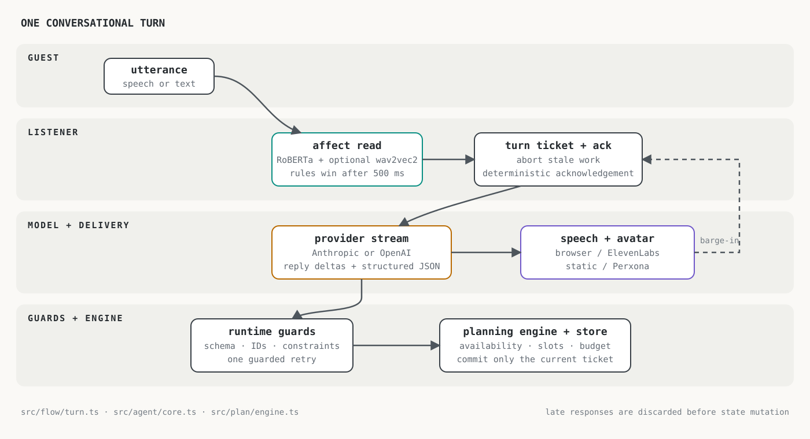
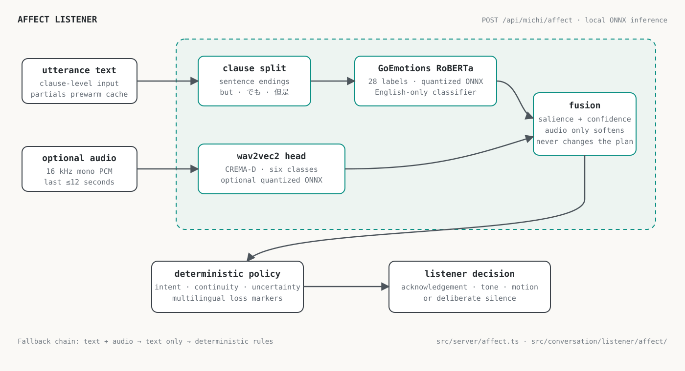
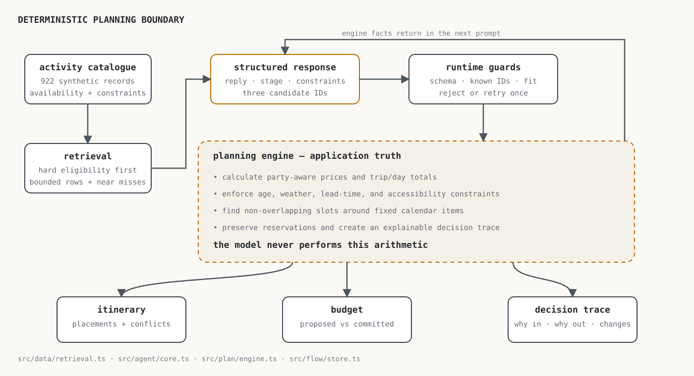

# Michi

Michi is a voice-first AI concierge for planning local activities in Tokyo. Describe the people, time, budget, weather, and mood around an outing; Michi proposes three options, explains what it ruled out, and places viable choices on a shared itinerary.

The language model handles the conversation. Deterministic TypeScript owns the calendar, prices, availability, and constraints, so a fluent answer cannot silently create an impossible plan.

> Michi is a hackathon prototype. Its catalogue is synthetic, availability is simulated, and checkout does not make a real reservation.

Built at the Perxona hackathon and later presented at AI Tinkerers Tokyo.

## Highlights

- Text and hands-free voice interfaces in English, Japanese, and Traditional Chinese
- Structured model responses with runtime validation and one guarded retry
- Deterministic filtering, scheduling, budget calculation, and decision traces
- Streaming speech: the first phrase can play while the rest of the response is generated
- Optional Perxona avatar and ElevenLabs voice, with browser fallbacks
- A local affect listener that combines text emotion and vocal tone without putting business decisions in the model
- Turn cancellation and stale-response protection for barge-in

## Quick start

Requirements: Node.js 20 or newer and npm.

```bash
git clone https://github.com/cris-cmd/michi.git
cd michi
npm install
cp .env.example .env
npm run dev
```

Open [http://localhost:5173](http://localhost:5173). Add an Anthropic or OpenAI key to `.env` for live conversations.

To explore the full flow without credentials, use the scripted agent:

```text
http://localhost:5173/?mockagent=1&mock=1
```

Click **Begin**, then switch to **Text** in the header. The mock mode uses no model, voice, or avatar APIs.

## Configuration

Planning-model and voice-provider credentials stay on the server. The Perxona presenter receives a short-lived Connect token when that integration is enabled. Vite exposes only same-origin `/api/michi/*` endpoints to the browser, and `npm run build` scans the generated bundle for secrets.

Start from [.env.example](.env.example). The only configuration needed for live planning is one provider key:

| Variable | Purpose | Required |
| --- | --- | --- |
| `MICHI_MODEL` | Model ID; `claude-*` selects Anthropic, `gpt-*`/`o*` selects OpenAI | No; defaults to `claude-sonnet-5` |
| `ANTHROPIC_API_KEY` | Anthropic API key (`CLAUDE_API_KEY` is also supported) | For Anthropic models |
| `OPENAI_API_KEY` | OpenAI API key | For OpenAI models |
| `MICHI_PROVIDER` | Explicit `anthropic` or `openai` override for unusual model IDs | No |
| `MICHI_EFFORT` | Provider reasoning effort: `low`, `medium`, or `high` | No; defaults to `low` |
| `MICHI_THINKING` | Set to `disabled` to minimize reasoning latency | No |
| `ELEVEN_LABS_API_KEY` | Higher-quality speech synthesis | No |
| `ELEVENLABS_VOICE_ID` | Overrides the default ElevenLabs voice | No |
| `PERXONA_*` | Presenter URL, credentials, and avatar asset IDs | No |
| `MICHI_DAILY_TURN_CAP` | Process-local daily limit for model turns | No; defaults to `500` |
| `PORT` | Port used by the production server | No; defaults to `8787` |
| `MICHI_TRUST_PROXY` | Trust a proxy-supplied client IP for rate limits | No; defaults to `false` |
| `NGROK_HOST` | Exact hostname allowed by Vite when using an ngrok tunnel | No |

When optional services are not configured, Michi falls back to browser speech and a simple CSS presence. Use `?voice=browser` to force browser speech.

`npm run dev` and `npm run serve` are intended for local or trusted demo environments. Before exposing Michi to the public internet with paid API keys, add application authentication and a durable shared rate limiter. Set `MICHI_TRUST_PROXY=true` only when a trusted reverse proxy removes client-supplied forwarding headers and writes its own.

## How a turn works

1. Speech recognition or the text composer produces an utterance.
2. The listener chooses a short acknowledgement from deterministic rules, optionally informed by local ONNX emotion models.
3. The selected provider streams a structured response containing the spoken reply and proposed state changes.
4. Runtime guards validate activity IDs, hard constraints, and the three-candidate contract.
5. The planning engine independently places valid activities, calculates the budget, and records the decision trace.



### Affect listener

Text and vocal-tone models produce signals; deterministic salience and fusion rules decide whether Michi should acknowledge, soften its delivery, or remain silent.



### Planning engine

The model proposes activities, while runtime guards and the planning engine independently enforce availability, time, party, and budget constraints.



The main boundaries and ownership rules are documented in [docs/architecture.md](docs/architecture.md).

## Development modes

Query parameters can be combined:

| Parameter | Effect |
| --- | --- |
| `?mockagent=1` | Uses the scripted agent and demo scenario; no model API call |
| `?mock=1` | Uses the static avatar; no speech APIs |
| `?demo=1` | Loads the repeatable rainy-afternoon demo context |
| `?nokit=1` | Skips Perxona and uses browser capabilities |
| `?nostt=1` | Disables browser speech recognition |
| `?voice=browser` | Skips ElevenLabs |
| `?debug=1` | Shows the latency and listener-state HUD |
| `?dev=1` | Shows the local demo reset control |

## Commands

```bash
npm run dev          # Vite app and API middleware
npm run build        # type-check, bundle, and scan for leaked secrets
npm test             # deterministic planning and race-condition checks
npm run eval         # replay model-backed scenarios (uses provider tokens)
npm run models:download  # install the optional audio model
npm run models:fixtures  # install ignored CREMA-D test clips
npm run test:affect      # evaluate text and installed audio models
npm run serve        # build and serve the complete app on PORT
```

## Models and data

Text affect uses [`SamLowe/roberta-base-go_emotions-onnx`](https://huggingface.co/SamLowe/roberta-base-go_emotions-onnx), an MIT-licensed, English-only GoEmotions classifier. Its approximately 125 MB quantized model downloads into `models/.cache` on first live use. Japanese and Chinese loss handling comes from explicit deterministic markers; the RoBERTa predictions themselves should not be described as multilingual.

Vocal tone uses Michi's optional [`cris-cmd/michi-audio-affect`](https://huggingface.co/cris-cmd/michi-audio-affect) model. Run `npm run models:download` to install the 117 MB quantized ONNX artifact under `models/affect/`. If it is absent, the listener falls back to text-only inference; if neither model is available within the latency budget, the deterministic acknowledgement policy still runs.

The first text-model download and cold start can take tens of seconds and use several hundred megabytes of memory. Warm inference is much faster. To run the complete local affect benchmark:

```bash
npm run models:download
npm run models:fixtures
npm run test:affect
```

To rebuild the audio model, install Python 3, then run `npm run models:audio`. The revision-pinned recipe uses a frozen Wav2Vec2 encoder and an actor-disjoint CREMA-D validation split. It downloads roughly 2.5 GB of build dependencies, model weights, and training data into `.cache/`; it does not provide a bit-for-bit reproducibility guarantee. Methodology and limitations are documented in the published model card.

## Project structure

```text
src/agent/          provider adapters, prompt, schema, and validation
src/avatar/         Perxona integration and browser/static fallbacks
src/conversation/   listener state, acknowledgements, affect, and metrics
src/data/           activity catalogue, availability, and retrieval
src/flow/           turn orchestration, persistence, and application state
src/plan/           deterministic schedule and budget engine
src/server/         API handlers, rate limits, affect inference, and auth
src/ui/             React interface
harness/            deterministic, concurrency, affect, and model evals
server/             production static/API server
```

## License

Michi's source code is available under the [MIT License](LICENSE). Downloaded models and datasets retain their own licenses; see their linked model cards for attribution and usage terms.
